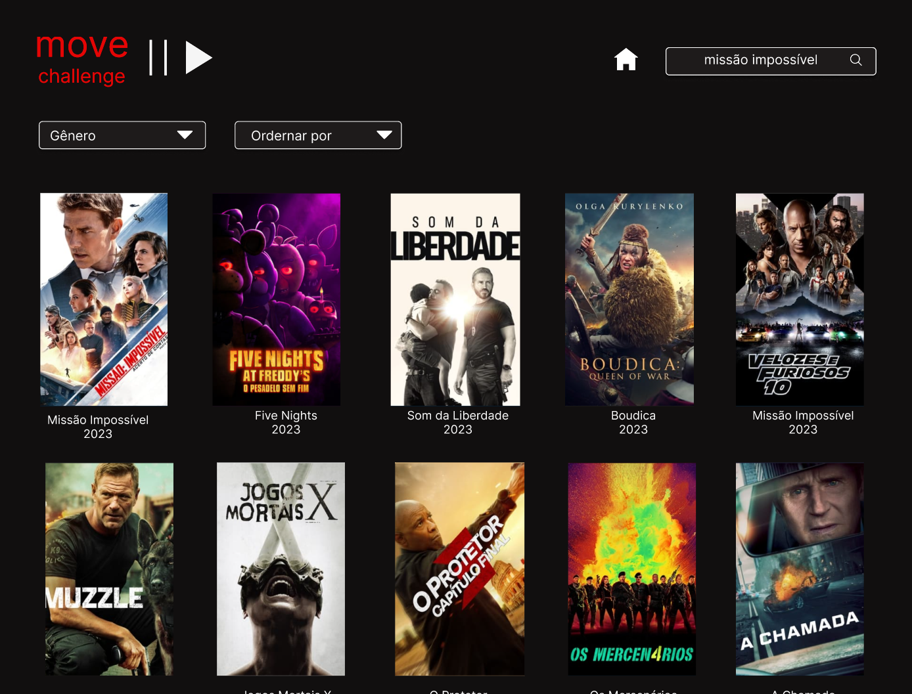

# MovieChallenge

## Índice
* [1. Prefácio](#1-prefacio) 
* [2. Protótipo em baixa](#2-baixa)
* [3. Protótipo em alta](#3-alta)
* [4. Histórias de usuários](#4-ui)
* [5. Testes](#5-testes) 
* [6. Checklists de Objetivos Alcançados](#6-checklist-de-objetivos-alcançados)
* [7. Tecnologias](#7-tecnologias)
* [8. Desenvolvido por](#8-desenvolvido)
## 1. Prefácio

Movie Challenge é uma projeto que usa o framewoek Angular com linguagem Tyscript e HTML. Criei uma página da web destinada a visualizar, filtrar e ordenar o catálogo de filmes da The Movie Database API V3. Esta página pode servir como um catálogo de filmes geral, mas também, se você quiser, pode considerar a possibilidade de projetá-la para um público específico com preferências como "filmes western" ou "filmes dos anos 80", por exemplo.

Como desenvolvedora Front-end, esses projeto foi desafiador e enriquecedor em aprendizado.

## 2. Protótipo em baixa

#### 2.1 Lista de filmes:

#### 2.2 Detalhes do filme:

## 3. Protótipo em alta

#### 3.1 Lista de filmes:

#### 3.2 Detalhes do filme:

## 4. Histórias de usuários

#### [História do Usuário 1] Lista de Filmes

Eu, como usuária, quero visualizar um catálogo de filmes em uma tabela
(linhas e colunas).

##### Critérios de aceitação

- Deve ser utilizado o _endpoint_
[/discover/movie](https://developer.themoviedb.org/reference/discover-movie).
- A aplicação deve incluir paginação para explorar o catálogo por páginas.
- Cada filme deve exibir pelo menos: pôster, título original e ano de lançamento.

##### Definição de Pronto

- Os componentes desenvolvidos devem ter testes unitários.

---

#### [História do Usuário 2] Filtro e Ordenação

Eu, como usuária, quero filtrar e ordenar o catálogo de filmes usando os
critérios suportados pela _TheMovie Database API V3_.

##### Critérios de Aceitação

- Para filtrar, deve ser usado o _endpoint_
[/discover/movie](https://developer.themoviedb.org/reference/discover-movie),
e um ou mais de seus parâmetros, como, por exemplo, _with_genres_.
- Para ordenar, deve ser usado o _endpoint_
[/discover/movie](https://developer.themoviedb.org/reference/discover-movie),
e um ou mais de seus parâmetros, como, por exemplo, _sort_by_.
- A paginação deve manter o filtro e a ordenação.
- Cada filme deve exibir pelo menos: pôster, título original e ano de lançamento.

##### Definição de Pronto

- Os componentes desenvolvidos devem ter testes unitários.

---

#### [História do Usuário 3] Detalhes de um Filme

Eu, como usuária, quero consultar os detalhes de um filme.

##### Critérios de Aceitação

- Deve ser usado o _endpoint_
[/movie/{movie_id}](https://developer.themoviedb.org/reference/movie-details).
- Para o filme, devem ser exibidos pelo menos: pôster, título original, ano
de lançamento, gêneros, média de votação e total de votos.
- A interface deve permitir retornar à lista de filmes, mantendo o filtro
e a ordenação.

##### Definição de Pronto

- Os componentes desenvolvidos devem ter testes unitários.

---

## 5. Teste
 
 Em codificação

## 6. Checklist de Objetivos Alcançados

  ✅ Tenha protótipo de alta fidelidade no Figma
  ✅ Atende a todos os critérios mínimos de aceitação
  ✅ Está hospedado no GitHub
  ✅ Está com o deploy realizado
  ✅ Possui um README com a definição do produto

## 7. Tecnologias

  
  
  

## 8. Desenvolvido por
  Alê Ribeiro   
  - [@Linkedin](https://www.linkedin.com/in/alessandra.ribeiro)
  - [@Github](https://github.com/ribeirober1208)
